# Design Document — EMT Málaga Map

## Overview

EMT Málaga Map es una aplicación Angular 20 que muestra en tiempo real la posición de los autobuses de la EMT de Málaga sobre un mapa OpenStreetMap renderizado con MapLibre GL y teselas de OpenFreeMap (sin API key). El usuario selecciona una línea para filtrar los buses visibles, ver el trazado de la ruta, sus paradas y los tiempos de llegada al pulsar cualquier parada. Las posiciones se actualizan automáticamente cada 60 segundos mediante polling.

### Decisiones de diseño clave

- **Standalone components everywhere**: todos los componentes son `standalone: true`. Sin NgModules.
- **Proxy obligatorio**: el cliente nunca llama directamente a `datosabiertos.malaga.eu` ni a `www.emtmalaga.es` (CORS). Los Angular SSR server routes actúan de intermediario.
- **Sin API key de mapas**: se usa MapLibre GL con teselas públicas de OpenFreeMap (`https://tiles.openfreemap.org/styles/bright`).
- **Separación de capas**: CSV/HTML parsing en `src/shared/utils/` y `src/app/server/`, estado global en NgRx Signal Store, recursos reactivos con `httpResource`/`rxResource`, UI en componentes standalone de feature.
- **`ng-maplibre-gl`** como integración Angular para MapLibre GL, equivalente a `react-map-gl`. La integración DOM directa con `ElementRef` + `afterRender()` es el fallback si `ng-maplibre-gl` tiene limitaciones.
- **`rxResource` para polling** (no `httpResource`): el polling con `timer(0, 60_000)` requiere un loader RxJS observable — solo `rxResource` lo soporta.
- **Caché en servidor**: en lugar de `staleTime` en el cliente, la estrategia de caché se gestiona con cabeceras `Cache-Control` en las server routes (`s-maxage=3600`, `no-store`, etc.).
- **CSV real**: los ficheros del Ayuntamiento usan comas como delimitador y comillas dobles como quoting (formato RFC 4180). El campo `codLinea` en ubicaciones llega como float-string (`"1.0"`); se normaliza a string entero (`"1"`) durante el parseo.
- **Snap a polilínea**: los marcadores de bus y de parada se proyectan sobre el trazado GTFS más cercano antes de renderizarse, para que aparezcan sobre la calzada.

---

## Architecture

### Diagrama de componentes y flujo de datos

```mermaid
graph TD
    subgraph Browser["Navegador (cliente — Angular)"]
        AppComp["AppComponent (raíz)"]
        LS["LineaSelectorComponent"]
        SF["SentidoFilterComponent"]
        MapaEMT["MapaEMTComponent (lazy)"]
        MCC["MapCameraControllerComponent"]
        BML["BusMarkersLayerComponent (interno)"]
        BM["BusMarkerComponent ×N"]
        RL["RutaLineaComponent"]
        PM["ParadaModalComponent"]
        Store["EMTStore (NgRx Signal Store)"]
        Resources["EMTResourcesService"]
        ResL["lineasResource (httpResource)"]
        ResU["ubicacionesResource (rxResource + timer)"]
        ResP["paradasResource (httpResource)"]
        ResS["shapesResource (httpResource)"]
        ResLL["llegadasResource (httpResource)"]
    end

    subgraph Server["Angular SSR (server routes)"]
        RouteL["GET /api/emt/lineas"]
        RouteU["GET /api/emt/ubicaciones?linea=X"]
        RouteP["GET /api/emt/paradas?linea=X"]
        RouteS["GET /api/emt/shapes?linea=X"]
        RouteLL["GET /api/emt/llegadas?parada=X"]
        Parser["CSV_Parser (shared/utils)"]
    end

    subgraph External["Orígenes externos"]
        EMT_L["lineasyparadas.csv (s-maxage:3600)"]
        EMT_U["lineasyubicaciones.csv (no-store)"]
        EMT_Mobile["emtmalaga.es/informacionParada.html"]
        GTFS["data/gtfs/shapes.csv + trips.csv (in-memory 30min)"]
    end

    AppComp --> LS
    AppComp --> SF
    AppComp --> MapaEMT
    MapaEMT --> MCC
    MapaEMT --> BML
    MapaEMT --> RL
    MapaEMT --> PM
    BML --> BM
    Resources --> ResL
    Resources --> ResU
    Resources --> ResP
    Resources --> ResS
    Resources --> ResLL
    Store --> Resources
    ResL --> LS
    ResU --> BML
    ResP --> RL
    ResS --> RL
    ResLL --> PM
    Store --> SF
    Store --> BML
    Store --> RL
    Store --> PM
    ResL -->|"GET /api/emt/lineas"| RouteL
    ResU -->|"GET /api/emt/ubicaciones?linea=X"| RouteU
    ResP -->|"GET /api/emt/paradas?linea=X"| RouteP
    ResS -->|"GET /api/emt/shapes?linea=X"| RouteS
    ResLL -->|"GET /api/emt/llegadas?parada=X"| RouteLL
    RouteL -->|"s-maxage:3600"| EMT_L
    RouteU -->|"no-store"| EMT_U
    RouteP -->|"s-maxage:1800"| EMT_L
    RouteLL -->|"no-store"| EMT_Mobile
    RouteLL -->|"fallback Haversine"| EMT_U
    RouteS --> GTFS
    EMT_L -->|CSV text| Parser
    EMT_U -->|CSV text| Parser
```



### Flujo de datos principal

1. `AppComponent` monta `<app-linea-selector>`, `<app-sentido-filter>` en la cabecera y carga `MapaEMTComponent` de forma lazy via Angular Router.
2. `LineaSelectorComponent` inyecta `EMTResourcesService` → `lineasResource.value()` (signal) → `GET /api/emt/lineas` → CSV_Parser → `LineaEMT[]`.
3. El usuario selecciona una línea → `store.setLineaSeleccionada(codLinea)` → la señal `store.lineaSeleccionada()` cambia → la función `request()` de `ubicacionesResource` se recomputa → nuevo polling RxJS se inicia automáticamente con `timer(0, 60_000)`.
4. `MapaEMTComponent` contiene `BusMarkersLayerComponent` (buses filtrados por sentido + snapped), `RutaLineaComponent` (polilíneas GeoJSON + marcadores de parada) y `MapCameraControllerComponent` (ajusta el encuadre al bounding box de las paradas).
5. `ParadaModalComponent` se abre cuando el usuario pulsa una parada; la señal `store.paradaSeleccionada()` cambia → `llegadasResource` reactivo se activa → `GET /api/emt/llegadas?parada=X`.
6. `SentidoFilterComponent` lee `cabeceraIda`/`cabeceraVuelta` del `lineasResource` y permite activar/desactivar cada sentido vía `store.toggleSentido()`.
7. `rxResource` con `timer(0, 60_000)` re-fetcha ubicaciones cada 60 s; `BusMarkersLayerComponent` actualiza los marcadores reactivamente al cambiar `ubicacionesResource.value()`.

---

## Components and Interfaces

### Estructura de ficheros completa

```
src/
├── app/
│   ├── server/
│   │   └── emt/
│   │       ├── constants.ts                 # URLs de origen y regex de validación
│   │       ├── lineas.server.ts             # GET /api/emt/lineas
│   │       ├── ubicaciones.server.ts        # GET /api/emt/ubicaciones?linea=X
│   │       ├── paradas.server.ts            # GET /api/emt/paradas?linea=X
│   │       ├── shapes.server.ts             # GET /api/emt/shapes?linea=X
│   │       └── llegadas.server.ts           # GET /api/emt/llegadas?parada=X
│   ├── app.component.ts                     # Componente raíz
│   ├── app.config.ts                        # provideRouter, provideHttpClient, provideClientHydration
│   ├── app.routes.ts                        # Rutas con lazy loading de MapaEMTComponent
│   └── app.routes.server.ts                 # RenderMode.Server para cada server route
├── features/
│   └── emt/
│       ├── components/
│       │   ├── linea-selector.component.ts  # Selector de línea (combobox)
│       │   ├── mapa-emt.component.ts        # Mapa MapLibre GL con sub-capas
│       │   ├── bus-marker.component.ts      # Marcador SVG individual de bus
│       │   ├── ruta-linea.component.ts      # Polilínea GeoJSON + marcadores de parada
│       │   ├── parada-modal.component.ts    # Popup MapLibre con llegadas
│       │   ├── sentido-filter.component.ts  # Toggles de sentido (ida/vuelta)
│       │   └── map-camera-controller.component.ts  # Ajuste automático de cámara
│       ├── services/
│       │   ├── emt-api.service.ts           # HttpClient wrappers — funciones puras
│       │   └── emt-resources.service.ts     # httpResource / rxResource declarations
│       ├── store/
│       │   └── emt.store.ts                 # NgRx Signal Store
│       ├── types/
│       │   └── emt.types.ts                 # BusUbicacion, LineaEMT, ParadaEMT, etc.
│       └── utils/
│           ├── linea-colors.ts              # Colores por línea/sentido
│           └── is-circular.ts              # Detección de líneas circulares
├── shared/
│   ├── components/
│   │   ├── loading-spinner.component.ts
│   │   ├── error-message.component.ts
│   │   └── map-skeleton.component.ts
│   └── utils/
│       ├── csv-parser.ts                    # parseUbicacionesCSV, parseLineasCSV, parseParadasCSV
│       ├── format-error-message.ts          # Convierte errores a strings legibles
│       ├── snap-to-polyline.ts              # Proyecta un punto sobre una polilínea
│       ├── catmull-rom-smooth.ts            # Suavizado Catmull-Rom de coordenadas
│       └── haversine.ts                     # Distancia Haversine entre dos puntos GPS
└── test/
    ├── msw-server.ts
    └── test-setup.ts
```

### Interfaces de componentes (Angular signals API)

```typescript
// BusMarkerComponent — recibe zoom para escalar el SVG
readonly bus  = input.required<BusUbicacion>()
readonly zoom = input.required<number>()

// RutaLineaComponent — recibe zoom para el thinning de paradas y tamaño de iconos
readonly zoom = input.required<number>()

// MapaEMTComponent — sin inputs; lee todo del store y de EMTResourcesService via inject()
// BusMarkersLayerComponent — sub-componente interno de MapaEMTComponent, no exportado
// MapCameraControllerComponent — sin inputs/outputs; produce efectos de cámara
// SentidoFilterComponent, LineaSelectorComponent, ParadaModalComponent — sin inputs
```

---

## Data Models

### Tipos TypeScript principales

```typescript
// src/features/emt/types/emt.types.ts

export interface BusUbicacion {
  codBus: string        // Identificador del vehículo
  codLinea: string      // Código de línea normalizado (ej: "1", no "1.0")
  sentido: number       // 1 = vuelta, 2 = ida
  longitud: number      // Coordenada X — rango [-180, 180]
  latitud: number       // Coordenada Y — rango [-90, 90]
  codParIni: string     // Código de parada de inicio de tramo
  lastUpdate: string    // Timestamp ISO de última actualización
}

export interface LineaEMT {
  codLinea: string      // Código único de línea (ej: "1")
  nombreLinea: string   // Nombre descriptivo
  cabeceraIda?: string  // Destino del sentido ida
  cabeceraVuelta?: string
}

export interface ParadaEMT {
  codLinea: string      // Código de la línea normalizado
  codParada: string     // Código identificador de la parada
  nombreParada: string
  sentido: number       // 1 = vuelta, 2 = ida
  orden: number         // Posición en la secuencia del recorrido
  longitud: number
  latitud: number
}

export interface LlegadaLinea {
  codLinea: string
  nombreLinea: string
  sentido: number
  destino: string       // Cabeceravuelta o cabeceraIda según sentido
  proximoBus: {
    codBus: string
    minutos: number
  }
}

export interface ShapePoint {
  latitud: number
  longitud: number
  sequence: number
}

export type ShapesByDirection = Record<number, ShapePoint[]>  // clave: sentido (1|2)

export interface ApiError {
  error: string
}
```

### Normalización de `codLinea`

El CSV de ubicaciones publica `codLinea` como float-string (`"1.0"`, `"10.0"`). El CSV de paradas lo publica como `codLineaStr` (`"1"`, `"10"`). El parser de ubicaciones normaliza el valor:

```typescript
// "1.0" → "1", "10.0" → "10", "C1.0" → "C1"
function normalizeCodLinea(raw: string): string {
  return raw.trim().replace(/\.0$/, '')
}
```

---

## Server Routes Design

### Constantes compartidas

```typescript
// src/app/server/emt/constants.ts
export const EMT_UBICACIONES_URL =
  'https://datosabiertos.malaga.eu/recursos/transporte/EMT/EMTlineasUbicaciones/lineasyubicaciones.csv'

export const EMT_LINEAS_URL =
  'https://datosabiertos.malaga.eu/recursos/transporte/EMT/EMTLineasYParadas/lineasyparadas.csv'

export const LINEA_PARAM_REGEX = /^[a-zA-Z0-9-]+$/
export const PARADA_PARAM_REGEX = /^[a-zA-Z0-9-]+$/
```

### Registro en `app.routes.server.ts`

```typescript
import { RenderMode, ServerRoute } from '@angular/ssr'

export const serverRoutes: ServerRoute[] = [
  { path: 'api/emt/lineas',       renderMode: RenderMode.Server },
  { path: 'api/emt/ubicaciones',  renderMode: RenderMode.Server },
  { path: 'api/emt/paradas',      renderMode: RenderMode.Server },
  { path: 'api/emt/shapes',       renderMode: RenderMode.Server },
  { path: 'api/emt/llegadas',     renderMode: RenderMode.Server },
  { path: '**',                   renderMode: RenderMode.Client },
]
```

### GET /api/emt/lineas

Fetches `EMT_LINEAS_URL`, parsea el CSV con `parseLineasCSV`, ordena por `codLinea` lexicográficamente y devuelve `LineaEMT[]`. Cabecera de respuesta: `Cache-Control: s-maxage=3600`. Los campos `cabeceraIda` y `cabeceraVuelta` se incluyen para que `SentidoFilterComponent` pueda mostrar las etiquetas de cada sentido.

### GET /api/emt/ubicaciones?linea={codLinea}

Fetches `EMT_UBICACIONES_URL`, parsea y filtra `b.codLinea === linea`. Devuelve `BusUbicacion[]`. Cabecera: `Cache-Control: no-store`. Valida que `linea` esté presente y coincida con `LINEA_PARAM_REGEX` (HTTP 400 si no).

### GET /api/emt/paradas?linea={codLinea}

Fetches `EMT_LINEAS_URL`, parsea el CSV con `parseParadasCSV`, filtra por `codLinea` y ordena ascendente por `sentido` → `orden`. Cabecera: `Cache-Control: s-maxage=1800`. Devuelve `ParadaEMT[]`.

### GET /api/emt/shapes?linea={codLinea}

Lee los GTFS locales (`data/gtfs/shapes.csv`, `data/gtfs/trips.csv`) con un caché en memoria de 1800 s. Cruza `trips.csv` para encontrar el `shape_id` por sentido, luego extrae las coordenadas ordenadas de `shapes.csv`. Devuelve `ShapesByDirection` (`{}` si no hay shapes para la línea).

### GET /api/emt/llegadas?parada={codParada}

Intenta obtener llegadas del scraping de `EMT_Mobile` (`informacionParada.html?codParada=X`) con `Cache-Control: no-store`. Si falla o no hay datos, cae en fallback Haversine: descarga `EMT_LINEAS_URL` y `EMT_UBICACIONES_URL` en paralelo con `Promise.all`, calcula distancia al bus más cercano en ruta usando `busIdx > targetIdx` y velocidad constante de 200 m/min. Devuelve `LlegadaLinea[]` ordenado por `minutos` ascendente.

---

## CSV Parser Design

### Formato real de los CSV

**lineasyubicaciones.csv** — delimitado por comas, con comillas dobles (RFC 4180):
```
"codBus","codLinea","sentido","lon","lat","codParIni","last_update"
"581","1.0","2","-4.456579","36.697693","1253","2026-05-25 19:45:06"
```

**lineasyparadas.csv** — delimitado por comas, con comillas dobles (RFC 4180):
```
"codLinea","codLineaStr","codLineaStrSin","userCodLinea","nombreLinea","observaciones",
"cabeceraIda","cabeceraVuelta",...,"sentido","orden",...,"codParada","nombreParada","lon","lat",...
```

El parser detecta automáticamente el delimitador (coma vs punto y coma) inspeccionando la primera línea, para ser robusto ante cambios del origen.

---

## NgRx Signal Store Design

```typescript
// src/features/emt/store/emt.store.ts
import { signalStore, withState, withMethods, patchState } from '@ngrx/signals'

interface ParadaSeleccionada {
  codParada: string
  nombreParada: string
  latitud: number
  longitud: number
  sentido: number
}

interface EMTState {
  lineaSeleccionada: string | null
  sentidosActivos: number[]           // [1, 2] por defecto; nunca vacío
  paradaSeleccionada: ParadaSeleccionada | null
}

export const EMTStore = signalStore(
  { providedIn: 'root' },
  withState<EMTState>({
    lineaSeleccionada: null,
    sentidosActivos: [1, 2],
    paradaSeleccionada: null,
  }),
  withMethods((store) => ({
    setLineaSeleccionada(linea: string | null): void {
      patchState(store, {
        lineaSeleccionada: linea,
        sentidosActivos: [1, 2],        // resetea al cambiar de línea
        paradaSeleccionada: null,
      })
    },
    toggleSentido(sentido: number): void {
      const current = store.sentidosActivos()
      const next = current.includes(sentido)
        ? current.filter(s => s !== sentido)
        : [...current, sentido]
      if (next.length === 0) return    // invariante: nunca vacío
      patchState(store, { sentidosActivos: next })
    },
    setParadaSeleccionada(parada: ParadaSeleccionada | null): void {
      patchState(store, { paradaSeleccionada: parada })
    },
  }))
)
```

**Invariante de `sentidosActivos`**: `toggleSentido` nunca deja el array vacío. Si el usuario intenta desactivar el único sentido activo, el toggle no hace nada.

**Efecto de `setLineaSeleccionada`**: resetea `sentidosActivos` a `[1, 2]` y limpia `paradaSeleccionada` en la misma llamada a `patchState`.

**Lectura en componentes** (acceso directo a signals, sin selectores separados):

```typescript
@Component({ ... })
export class LineaSelectorComponent {
  readonly store = inject(EMTStore)

  // En template: {{ store.lineaSeleccionada() }}
  // Acceso granular automático — solo re-evalúa si cambia la señal específica
}
```

---

## Angular Resources Design

### `EMTResourcesService`

```typescript
// src/features/emt/services/emt-resources.service.ts
@Injectable({ providedIn: 'root' })
export class EMTResourcesService {
  private readonly store = inject(EMTStore)
  private readonly http  = inject(HttpClient)

  // Petición única — líneas estáticas
  readonly lineasResource = httpResource<LineaEMT[]>('/api/emt/lineas')

  // rxResource con polling — única excepción; requiere loader RxJS
  readonly ubicacionesResource = rxResource({
    request: () => this.store.lineaSeleccionada(),
    loader: ({ request: linea }) => {
      if (!linea) return of([] as BusUbicacion[])
      return this.buildPollingObservable(linea)
    },
  })

  // httpResource reactivo — se recalcula cuando cambia la señal
  readonly paradasResource = httpResource<ParadaEMT[]>(() => {
    const linea = this.store.lineaSeleccionada()
    return linea ? `/api/emt/paradas?linea=${linea}` : undefined
  })

  readonly shapesResource = httpResource<ShapesByDirection>(() => {
    const linea = this.store.lineaSeleccionada()
    return linea ? `/api/emt/shapes?linea=${linea}` : undefined
  })

  readonly llegadasResource = httpResource<LlegadaLinea[]>(() => {
    const parada = this.store.paradaSeleccionada()
    return parada ? `/api/emt/llegadas?parada=${parada.codParada}` : undefined
  })

  private buildPollingObservable(linea: string): Observable<BusUbicacion[]> {
    const visible$ = fromEvent(document, 'visibilitychange').pipe(
      startWith(null),
      filter(() => !document.hidden),
      switchMap(() => timer(0, POLL_INTERVAL_MS)),
    )
    return visible$.pipe(
      switchMap(() => this.http.get<BusUbicacion[]>(`/api/emt/ubicaciones?linea=${linea}`))
    )
  }
}
```

### Tabla de recursos por tipo de dato

| Resource | Patrón | Polling | Caché servidor |
|---|---|---|---|
| `lineasResource` | `httpResource('/api/emt/lineas')` | no | `s-maxage=3600` |
| `ubicacionesResource` | `rxResource` + `timer(0, 60_000)` | 60s | `no-store` |
| `paradasResource` | `httpResource(reactiveUrl)` | no | `s-maxage=1800` |
| `shapesResource` | `httpResource(reactiveUrl)` | no | sin caché específico |
| `llegadasResource` | `httpResource(reactiveUrl)` | no | `no-store` |

**Nota de diseño sobre `staleTime`**: a diferencia de TanStack Query, `httpResource` no tiene una opción `staleTime` en el cliente. La estrategia de caché se delega completamente a las cabeceras HTTP del servidor. El navegador y los proxies intermedios (CDN de Vercel) respetan estas cabeceras.

---

## Components Design

### `app.component.ts` + `app.routes.ts`

```typescript
// app.routes.ts — MapaEMTComponent cargado lazy (MapLibre GL requiere APIs de browser)
export const routes: Routes = [
  {
    path: '',
    loadComponent: () =>
      import('./features/emt/components/mapa-emt.component').then(m => m.MapaEMTComponent),
  },
]
```

```typescript
// app.component.ts — shell con header + router-outlet
@Component({
  selector: 'app-root',
  standalone: true,
  imports: [RouterOutlet, LineaSelectorComponent, SentidoFilterComponent, MapSkeletonComponent],
  template: `
    <main class="flex h-screen flex-col">
      <header class="flex items-center gap-4 border-b ...">
        <h1>EMT Málaga</h1>
        <app-linea-selector />
        <app-sentido-filter />
      </header>
      <div class="flex-1">
        <router-outlet />
      </div>
    </main>
  `,
})
export class AppComponent {}
```

### `MapaEMTComponent`

Responsabilidades:

1. Renderiza el contenedor del mapa con `ng-maplibre-gl` usando estilo OpenFreeMap.
2. En el evento `mapLoad` aplica customizaciones de estilo: oculta edificios 3D, filtra POIs turísticos/recreativos, ajusta colores de carreteras a blancos, añade capas de parques y edificios religiosos.
3. Rastrea el zoom actual para pasarlo a `BusMarkersLayerComponent` y `RutaLineaComponent`.
4. Delega en sub-componentes: `<app-map-camera-controller />`, `<app-ruta-linea [zoom]="zoom" />`, `<app-bus-markers-layer [zoom]="zoom" />`, `<app-parada-modal />`.
5. Superpone indicadores de `isLoading`, `isStale` e `isError` sobre el mapa.

**`BusMarkersLayerComponent`** (interno, no exportado desde el módulo): filtra los buses por `sentidosActivos`, aplica `snapToPolyline` a cada bus usando el shape del sentido correspondiente, y renderiza un `<app-bus-marker>` por bus.

### `BusMarkerComponent`

Renderiza un marcador de `ng-maplibre-gl` con un SVG circular. El color de relleno viene de `getSentidoColor(codLinea, sentido)`. El radio del círculo escala con el zoom:

| zoom | tamaño (px) |
|---|---|
| ≥ 16 | 32 |
| ≥ 15 | 26 |
| ≥ 14 | 20 |
| ≥ 13 | 16 |
| < 13 | 12 |

El texto del círculo es el código de línea abreviado (p. ej. `"C1"` para líneas circulares).

### `RutaLineaComponent`

Responsabilidades:

1. Lee `paradasResource.value()` y `shapesResource.value()` de `EMTResourcesService` vía `inject()`.
2. Para cada sentido activo: construye la polilínea de coordenadas (shapes si están disponibles, fallback a coordenadas de paradas), aplica suavizado Catmull-Rom (`catmullRomSmooth`) con factor 4 (shapes) o 8 (fallback), y la renderiza como capa GeoJSON LineString en `ng-maplibre-gl`.
3. Aplica thinning de paradas (`thinParadas`) para suprimir marcadores intermedios cuando dos paradas adyacentes quedan a menos de 28 px de pantalla, preservando siempre la primera y la última.
4. Para cada parada visible: aplica `snapToPolyline` si hay shapes, renderiza un marcador SVG con un círculo blanco bordeado con el color del sentido; al pulsar llama a `store.setParadaSeleccionada()`.

### `ParadaModalComponent`

Renderiza un popup de `ng-maplibre-gl` (`closeOnClick: false`) anclado a las coordenadas de `store.paradaSeleccionada()`. Consume `llegadasResource.value()` y muestra:

- Spinner mientras carga.
- Lista de `LlegadaLinea` agrupada: primero las entradas de la línea actualmente seleccionada (badge coloreado + destino + minutos), luego las del resto de líneas separadas por un divisor.
- "No hay buses en camino" si el array está vacío.
- Para líneas circulares sin `destino`, muestra `"Circular {codLinea}"` como fallback.
- Cierra y llama a `store.setParadaSeleccionada(null)` al pulsar la X.

### `SentidoFilterComponent`

Solo se renderiza cuando hay una línea seleccionada, la línea no es circular (`isCircular(nombreLinea)`) y ambas cabeceras (`cabeceraIda`, `cabeceraVuelta`) son no vacías. Muestra dos filas con un toggle switch coloreado por sentido. Llama a `store.toggleSentido(sentido)`.

### `MapCameraControllerComponent`

Componente sin template visible (`template: ''`). Inyecta la referencia al mapa via `ng-maplibre-gl`. Usa `afterRender()` para observar cambios en `linea` o `paradas` y llamar a `map.fitBounds(bounds, { padding: 40 })`.

---

## Shared Utilities

### snapToPolyline

```typescript
// src/shared/utils/snap-to-polyline.ts
// Proyecta (lat, lng) sobre el segmento más cercano de una polilínea de ShapePoints.
// Devuelve { lat, lng } del punto proyectado.
export function snapToPolyline(
  lat: number, lng: number,
  shape: ShapePoint[]
): { lat: number; lng: number }
```

### catmullRomSmooth

```typescript
// src/shared/utils/catmull-rom-smooth.ts
// Interpola una serie de puntos con la curva Catmull-Rom.
// factor controla el número de puntos interpolados por segmento.
export function catmullRomSmooth(
  points: Array<{ lat: number; lng: number }>,
  factor: number
): Array<{ lat: number; lng: number }>
```

### lineaColors

```typescript
// src/features/emt/utils/linea-colors.ts

export function getLineaColor(codLinea: string): string
export function getSentidoColor(codLinea: string, sentido: number): string
export function getTextColor(bgColor: string): string
export function getTextShadow(textColor: string): string
export function getLineaLabel(codLinea: string): string
```

---

## Correctness Properties

### Property 1: El parser de ubicaciones produce objetos con forma y rangos válidos

Para cualquier CSV de ubicaciones con N filas de datos válidas, `parseUbicacionesCSV` debe devolver exactamente N objetos `BusUbicacion`, cada uno con `codLinea` no vacío, `latitud` en `[-90, 90]` y `longitud` en `[-180, 180]`.

**Validates: Requirements 2.5, 3.1**

### Property 2: El parser de líneas produce objetos con forma válida y sin duplicados

Para cualquier CSV de líneas con M filas de datos válidas (potencialmente con líneas repetidas), `parseLineasCSV` debe devolver un array de `LineaEMT` donde cada objeto tiene `codLinea` y `nombreLinea` no vacíos, y no hay dos objetos con el mismo `codLinea`.

**Validates: Requirements 1.3, 3.2**

### Property 3: El parser descarta filas inválidas y preserva las válidas

Para cualquier CSV con mezcla de filas válidas e inválidas (columnas incorrectas, valores numéricos no finitos, campos requeridos vacíos, coordenadas fuera de rango), el parser debe devolver exactamente las filas válidas sin lanzar excepciones.

**Validates: Requirements 3.3, 3.5, 3.6**

### Property 4: El parser recorta espacios en blanco de todos los campos string

Para cualquier CSV donde los campos string tengan espacios en blanco al inicio o al final, el parser devuelve objetos con todos los campos string recortados (`trim()`).

**Validates: Requirements 3.4**

### Property 5: La lista de líneas está ordenada lexicográficamente por codLinea

Para cualquier CSV de líneas válido (independientemente del orden de las filas), `GET /api/emt/lineas` devuelve un array donde `codLinea[i] <= codLinea[i+1]` para todo `i`.

**Validates: Requirements 1.6**

### Property 6: El filtrado de ubicaciones devuelve solo buses de la línea solicitada

Para cualquier conjunto de buses con `codLinea` variados y cualquier código de línea válido `L`, `GET /api/emt/ubicaciones?linea=L` devuelve únicamente buses cuyo `codLinea === L`; si ninguno coincide, devuelve un array vacío.

**Validates: Requirements 2.1, 2.6**

### Property 7: Los errores HTTP del origen se propagan con el mismo status code

Para cualquier código de estado HTTP no-2xx `S` devuelto por `EMT_Origin`, los server routes devuelven una respuesta con exactamente el mismo status code `S` y un campo `error` con una cadena no vacía.

**Validates: Requirements 1.4, 2.7**

### Property 8: El parámetro linea con caracteres inválidos devuelve 400

Para cualquier string con al menos un carácter no alfanumérico ni guión, `GET /api/emt/ubicaciones?linea={string}` devuelve HTTP 400 con un campo `error` no vacío.

**Validates: Requirements 2.3**

### Property 9: MapaEMT renderiza exactamente un BusMarker por bus activo

Para cualquier array de `BusUbicacion` con coordenadas válidas, `BusMarkersLayerComponent` renderiza exactamente `buses.filter(b => sentidosActivos.includes(b.sentido)).length` marcadores.

**Validates: Requirements 6.1, 6.8**

### Property 10: LineaSelector muestra todas las líneas como opciones seleccionables

Para cualquier array de `LineaEMT` no vacío, `LineaSelectorComponent` renderiza exactamente `lineas.length` opciones, cada una mostrando el `codLinea` y `nombreLinea` correspondientes.

**Validates: Requirements 4.3**

### Property 11: El store refleja siempre la última línea seleccionada

Para cualquier secuencia de selecciones, `EMTStore.lineaSeleccionada()` es igual al `codLinea` de la última selección; y `sentidosActivos()` siempre es `[1, 2]` inmediatamente después de cada cambio de línea.

**Validates: Requirements 5.1, 5.3, 15.3**

### Property 12: Los mensajes de error son siempre cadenas legibles sin datos técnicos

Para cualquier error (instancia de `Error`, objeto arbitrario, o `null`), `formatErrorMessage` devuelve una cadena no vacía que no contiene stack traces, códigos de estado HTTP crudos ni representaciones JSON de objetos de error.

**Validates: Requirements 9.6**

### Property 13: sentidosActivos nunca queda vacío

Para cualquier secuencia de llamadas a `toggleSentido`, `EMTStore.sentidosActivos()` siempre contiene al menos un elemento.

**Validates: Requirements 15.2**

---

## Error Handling

### Estrategia de errores por capa

| Capa | Tipo de error | Respuesta |
|---|---|---|
| Server Route — origen no-2xx | `res.ok === false` | Propagar mismo status + `{ error: string }` |
| Server Route — red/timeout | `fetch` lanza excepción | HTTP 500 + `{ error: string }` |
| Server Route — parámetro inválido | Validación manual | HTTP 400 + `{ error: string }` |
| `httpResource` / `rxResource` — fetch falla | Error HTTP o de red | `resource.error()` signal se activa |
| `MapaEMTComponent` — polling falla | `ubicacionesResource.error()` | Mantiene BusMarkers, muestra banner de error |

### Comportamiento ante errores de polling (Req. 7.6)

Cuando un tick del `rxResource` falla, el recurso mantiene el último `value()` exitoso y activa `error()`. `MapaEMTComponent` usa esta combinación para mantener los marcadores existentes y mostrar un indicador de error superpuesto.

```typescript
// Patrón en MapaEMTComponent
readonly buses    = this.resources.ubicacionesResource.value     // Signal<BusUbicacion[]>
readonly hasError = this.resources.ubicacionesResource.error     // Signal<unknown>
readonly isStale  = computed(() =>
  this.buses().length > 0 && this.hasError() !== undefined
)
```

---

## Testing Strategy

### Herramientas

- **Jest** — runner de tests
- **Angular Testing Library** (`@testing-library/angular`) — tests de componentes
- **MSW (Mock Service Worker)** — mocks de API HTTP
- **fast-check** — property-based testing

### Distribución de tests por tipo

#### Property-Based Tests (fast-check)

Los parsers CSV son funciones puras con espacio de entrada grande. Son el candidato ideal para PBT.

**Tests PBT a implementar** (uno por propiedad de corrección):

| Test | Propiedad | Archivo |
|---|---|---|
| Parser ubicaciones — forma y rangos | Property 1 | `csv-parser.test.ts` |
| Parser líneas — forma y deduplicación | Property 2 | `csv-parser.test.ts` |
| Parser — robustez ante filas inválidas | Property 3 | `csv-parser.test.ts` |
| Parser — trim de espacios | Property 4 | `csv-parser.test.ts` |
| Ordenación de líneas | Property 5 | `lineas.server.test.ts` |
| Filtrado de ubicaciones | Property 6 | `ubicaciones.server.test.ts` |
| Propagación de errores HTTP | Property 7 | `lineas.server.test.ts`, `ubicaciones.server.test.ts` |
| Validación parámetro linea inválido | Property 8 | `ubicaciones.server.test.ts` |
| sentidosActivos nunca vacío | Property 13 | `emt.store.test.ts` |
| formatErrorMessage — sin datos técnicos | Property 12 | `format-error-message.test.ts` |

Configuración: mínimo 200 iteraciones por test PBT (`numRuns: 200`).

#### Unit Tests (Jest) — lógica pura

```
src/shared/utils/csv-parser.test.ts           — edge cases: CSV vacío, solo cabecera, BOM
src/shared/utils/format-error-message.test.ts — ejemplos concretos de errores
src/shared/utils/snap-to-polyline.test.ts     — casos límite de proyección
src/shared/utils/catmull-rom-smooth.test.ts   — arrays de 0, 1, 2 puntos
src/features/emt/store/emt.store.test.ts      — acciones, invariante sentidosActivos
src/features/emt/services/emt-api.service.test.ts  — métodos HttpClient con MSW
```

#### Component Tests (Angular Testing Library + MSW) — comportamiento de UI

```
src/features/emt/components/linea-selector.component.test.ts
  - Muestra spinner mientras carga (Req. 4.2)
  - Muestra opciones cuando carga completa (Req. 4.3) — Property 10
  - Muestra error + retry cuando falla (Req. 4.4, 9.2)
  - Muestra empty state con 0 líneas (Req. 4.6)
  - Llama a store.setLineaSeleccionada al seleccionar (Req. 5.1)

src/features/emt/components/mapa-emt.component.test.ts
  - No renderiza BusMarkers sin línea seleccionada (Req. 5.4)
  - Renderiza N BusMarkers para N buses del sentido activo (Req. 6.1, 6.8)
  - Muestra loading overlay sin quitar marcadores (Req. 6.3)
  - Muestra error sin quitar marcadores (Req. 6.4, 9.3)
  - Muestra empty state con 0 buses (Req. 6.7)
  - Muestra staleness indicator tras error de polling (Req. 7.6)

src/features/emt/components/sentido-filter.component.test.ts
  - No renderiza sin línea seleccionada (Req. 15.6)
  - No renderiza para líneas circulares (Req. 15.4)
  - Toggle llama a store.toggleSentido (Req. 15.2)

src/features/emt/components/parada-modal.component.test.ts
  - No renderiza sin paradaSeleccionada (Req. 14.1)
  - Muestra spinner mientras carga llegadas (Req. 14.3)
  - Muestra "No hay buses en camino" con array vacío (Req. 14.6)
  - Cierra al pulsar X (Req. 14.7)
```

Los tests de componentes mockean `ng-maplibre-gl` para evitar dependencia de WebGL en el entorno de test.

### Cobertura objetivo

| Módulo | Cobertura mínima |
|---|---|
| `src/shared/utils/csv-parser.ts` | 95% |
| `src/shared/utils/format-error-message.ts` | 100% |
| `src/shared/utils/snap-to-polyline.ts` | 85% |
| `src/features/emt/store/emt.store.ts` | 90% |
| `src/features/emt/services/emt-api.service.ts` | 85% |
| `src/features/emt/services/emt-resources.service.ts` | 80% |
| `src/features/emt/components/` | 75% |
| `src/app/server/emt/` | 80% |

---

## Performance Considerations

### Bundle — carga diferida de MapLibre GL

```typescript
// app.routes.ts — MapaEMTComponent cargado solo en cliente via lazy loading
{
  path: '',
  loadComponent: () =>
    import('./features/emt/components/mapa-emt.component').then(m => m.MapaEMTComponent),
}
```

`maplibre-gl` y `ng-maplibre-gl` son pesados. Con `loadComponent` en el Angular Router se excluyen del bundle inicial y se cargan solo cuando la ruta se activa en el cliente.

### Change detection — signals + OnPush

`MapaEMTComponent`, `BusMarkersLayerComponent`, `RutaLineaComponent`, `SentidoFilterComponent` y `ParadaModalComponent` leen señales directamente del store y de los recursos. Angular solo re-evalúa las secciones del template donde se leen las señales — sin necesidad de selectores manuales como en Zustand.

### Re-renders — BusMarker estable

Los `BusMarkerComponent` se identifican por `@for (bus of buses; track bus.codBus)`. Angular solo re-monta los marcadores que realmente cambian de posición entre polls.

### Re-renders — thinning de paradas

`thinParadas` calcula proyecciones Mercator para suprimir marcadores de parada que quedarían a menos de 28 px entre sí al zoom actual. Esto evita renderizar cientos de marcadores innecesarios en zooms bajos.

### Async — fetches paralelos

`GET /api/emt/llegadas` usa `Promise.all` para descargar en paralelo el CSV de líneas y el de ubicaciones cuando aplica el fallback Haversine.

### Polling — eficiencia de rxResource

- El `timer(0, 60_000)` dentro del loader de `rxResource` reusa la misma suscripción mientras `linea` no cambie.
- Cuando cambia `lineaSeleccionada()`, el `request()` signal cambia → `rxResource` cancela la suscripción anterior y crea una nueva con el nuevo valor de linea.
- La pausa al ocultar la pestaña se gestiona con `fromEvent(document, 'visibilitychange')` combinado con `filter(() => !document.hidden)`.

---

## Deployment (Vercel)

### Región obligatoria: `cdg1` (París)

El servidor `emtmalaga.es` bloquea conexiones desde IPs de EEUU. La región por defecto de Vercel (`iad1`, Washington DC) provoca un error de red (`fetch failed`) en `GET /api/emt/llegadas`, activando silenciosamente el fallback Haversine.

**Solución:** `vercel.json` en la raíz del proyecto:

```json
{ "regions": ["cdg1"] }
```

- `mad1` (Madrid) **no es una región válida** de Vercel — se ignora sin error.
- Regiones europeas válidas: `cdg1` (París), `fra1` (Frankfurt), `lhr1` (Londres).
- Verificar con el header `x-vercel-id` de la respuesta: `cdg1::cdg1::...` = función en Europa ✓ / `cdg1::iad1::...` = función en EEUU ✗.

### Angular SSR en Vercel

Angular SSR con `@angular/ssr` se despliega en Vercel como funciones serverless. Los server routes registrados con `RenderMode.Server` se ejecutan en Node.js server-side. Requiere que `@angular/ssr` esté configurado en el proyecto.

Sin configuración explícita, Vercel puede cachear respuestas en su CDN. Los server routes que deben ser dinámicos deben responder con `Cache-Control: no-store` (ya gestionado en el handler de cada route).
